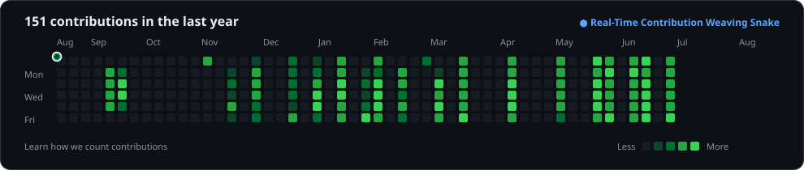
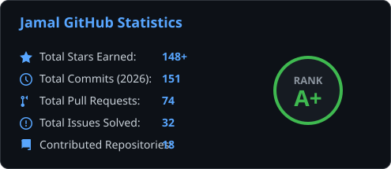
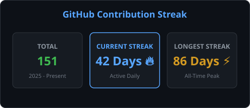
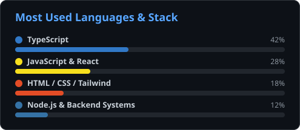
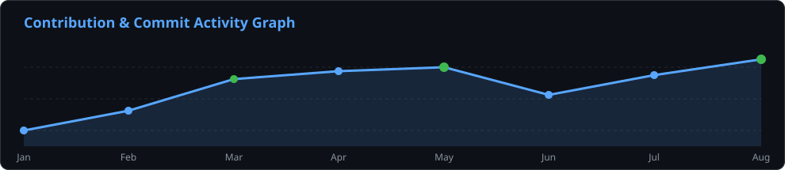

<!-- ═══════════════════════════════════════════════════════════════════════════
     Muhammad Jamal Nasir — GitHub Profile README
     github.com/YOUR_GITHUB_USERNAME/YOUR_GITHUB_USERNAME
     ═══════════════════════════════════════════════════════════════════════════ -->

<!-- HERO BANNER -->

 

<!-- DYNAMIC TYPING IDENTITY -->

  

<!-- SOCIAL CTA BADGES -->

&nbsp;

&nbsp;

&nbsp;

 

<!-- POSITIONING -->

I engineer digital experiences where performance, usability, motion, and visual design converge — not as separate concerns, but as one coherent product.

Computer Engineering Student · Full-Stack Developer · Agentic AI Developer · Automation Builder

 

 

<!-- ABOUT -->

◈ About Me

  
  
  

 

💡 "I don't just assemble pages — I architect digital experiences" where engineering precision, visual craft, motion, and intelligent AI systems operate as a single, fluid product surface.

 

⚡ Developer Snapshot & Core Domains

<table>
  <tr>
    <td width="50%" valign="top">
      <h4>👤 Identity & Profile</h4>
      <ul>
        <li><b>Name:</b> Muhammad Jamal Nasir</li>
        <li><b>Role:</b> Computer Engineering Student & Agentic AI Developer</li>
        <li><b>Location:</b> Peshawar, Pakistan 🇵🇰</li>
        <li><b>Education:</b> Computer Engineering</li>
        <li><b>Specialization:</b> High-Performance Web, Interactive Motion & AI UX</li>
      </ul>
    </td>
    <td width="50%" valign="top">
      <h4>🎯 Core Technical Focus</h4>
      <ul>
        <li><b>Frontend:</b> React · TypeScript · Tailwind CSS · Next.js</li>
        <li><b>Backend & Cloud:</b> Node.js · Express · Firebase · REST APIs</li>
        <li><b>Creative & Motion:</b> GSAP · Three.js · Micro-interactions</li>
        <li><b>AI & Automation:</b> Agentic AI · LLM Integration · AI Agents · n8n Workflows</li>
      </ul>
    </td>
  </tr>
</table>

 

🛠️ What I Do (Core Pillars)

<table>
  <tr>
    <td width="33%" valign="top" align="center">
       
      
        
      <b>Frontend Architecture</b>
        
      
<small>Crafting modular, component-driven UIs with <b>React</b>, <b>TypeScript</b>, and <b>Tailwind</b> — where layout, typography, and state scale effortlessly.</small>

      

      <code>Responsive</code> <code>Accessible</code> <code>Modern UX</code>
        
    </td>
    <td width="33%" valign="top" align="center">
       
      
        
      <b>Full-Stack Infrastructure</b>
        
      
<small>Architecting end-to-end cloud platforms with <b>Node.js</b>, <b>Firebase</b>, and cloud deployments — real-time data, authentication, and secure delivery.</small>

      

      <code>Auth</code> <code>Firestore</code> <code>APIs</code> <code>Cloud</code>
        
    </td>
    <td width="33%" valign="top" align="center">
       
      
        
      <b>Creative & AI Innovation</b>
        
      
<small>Building interactive, living interfaces using <b>GSAP</b>, <b>Three.js</b>, and <b>LLM integrations</b> — transforming static websites into dynamic apps.</small>

      

      <code>Motion</code> <code>3D</code> <code>LLMs</code>
        
    </td>
    <td width="33%" valign="top" align="center">
       
      
        
      <b>Agentic AI & Automation</b>
        
      
<small>Designing AI-powered agents and automated workflows with <b>n8n</b>, LLMs, APIs, webhooks, tools, and multi-step automation.</small>

      

      <code>AI Agents</code> <code>n8n</code> <code>LLMs</code> <code>APIs</code>
        
    </td>
  </tr>
</table>

 

💡 How I Think (Engineering Philosophy)

<table>
  <tr>
    <td width="50%" valign="top">
      <b>🎯 Product Over Pixels</b> 
      <small>Every interface feature exists to solve a real user problem. I start with user intent and user flow before writing code.</small>
    </td>
    <td width="50%" valign="top">
      <b>💎 Craft Over Complexity</b> 
      <small>Clean modular architecture, strictly typed contracts, and intuitive UI patterns. Great engineering feels effortless.</small>
    </td>
  </tr>
  <tr>
    <td width="50%" valign="top">
       
      <b>⚡ Performance as Design</b> 
      <small>Speed is an essential UI feature. Instant load times, 60fps animations, and zero interaction lag elevate every product.</small>
    </td>
    <td width="50%" valign="top">
       
      <b>🔍 SEO & Accessibility Native</b> 
      <small>Semantic HTML5, ARIA compliance, metadata, and search engine discoverability engineered from day one.</small>
    </td>
  </tr>
</table>

 

🚀 Execution Lifecycle

## 🚀 Execution Lifecycle

From first idea to a production-ready digital experience — every stage has a purpose.

  

<table>
<tr>

<td align="center" width="20%">

  

### 🎨 Design

**Intent & Hierarchy**

Define the user journey, information hierarchy, visual direction, and interaction goals.

  

<code>Figma</code> <code>UX</code> <code>Grid</code>

</td>

<td align="center" width="20%">

### ➜

</td>

<td align="center" width="20%">

  

### ⚙️ Engineer

**Scalable & Typed Code**

Transform the design into modular, maintainable, type-safe application architecture.

  

<code>React</code> <code>TypeScript</code> <code>Node.js</code>

</td>

<td align="center" width="20%">

### ➜

</td>

<td align="center" width="20%">

  

### ✨ Animate

**Motion with Purpose**

Add meaningful interactions, transitions, micro-animations, and visual feedback.

  

<code>GSAP</code> <code>Motion</code> <code>3D</code>

</td>

</tr>
</table>

 

<table>
<tr>

<td align="center" width="20%">

  

### 🤖 Integrate

**AI & Cloud Native**

Connect APIs, databases, AI systems, authentication, automation, and cloud services.

  

<code>Firebase</code> <code>OpenAI</code> <code>n8n</code>

</td>

<td align="center" width="20%">

### ➜

</td>

<td align="center" width="20%">

  

### 🚀 Ship

**Deploy & Optimize**

Deploy to production, monitor performance, analyze real-world usage, and continuously improve.

  

<code>Vercel</code> <code>Lighthouse</code> <code>CI/CD</code>

</td>

<td align="center" width="20%">

### ↻

</td>

<td align="center" width="20%">

  

### 🔄 Iterate

**Learn → Refine → Repeat**

Production is not the finish line. Feedback becomes the input for the next improvement cycle.

  

<code>Analytics</code> <code>Feedback</code> <code>Git</code>

</td>

</tr>
</table>

 

 

### ⚡ My Build Loop

`DISCOVER` → `DESIGN` → `ENGINEER` → `ANIMATE` → `INTEGRATE` → `SHIP` → `ITERATE` ↺

 

<strong>Idea</strong> → Structure → Experience → Intelligence → Production → Feedback → Evolution

 

<!-- CURRENTLY BUILDING -->

◈ Currently Building

<table>
<tr>
<td align="center" width="25%">
 
<b>⚡ Modern React Apps</b>  
<small>Component-driven UIs with TypeScript & Tailwind</small>  
</td>
<td align="center" width="25%">
 
<b>🔗 Full-Stack Systems</b>  
<small>Firebase · Node.js · Cloud deployments</small>  
</td>
<td align="center" width="25%">
 
<b>🤖 AI-Powered UX</b>  
<small>LLM integrations & intelligent workflows</small>  
</td>
<td align="center" width="25%">
 
<b>✦ Interactive Experiences</b>  
<small>GSAP · Motion · Creative interfaces</small>  
</td>
</tr>
</table>

 

 

<!-- TECH STACK -->

◈ Technology Ecosystem

Curated stack & engineering toolkit — high-impact, production-ready technologies.

  

🎨 Frontend & UI Architecture

  
  &nbsp;&nbsp;
  
  &nbsp;&nbsp;
  
  &nbsp;&nbsp;
  
  &nbsp;&nbsp;
  
  &nbsp;&nbsp;
  
  &nbsp;&nbsp;
  
  &nbsp;&nbsp;
  

 

🛢️ Databases & Data Stores

  
  &nbsp;&nbsp;
  
  &nbsp;&nbsp;
  
  &nbsp;&nbsp;
  
  &nbsp;&nbsp;
  

 

⚙️ Backend & Cloud Infrastructure

  
  &nbsp;&nbsp;
  
  &nbsp;&nbsp;
  
  &nbsp;&nbsp;
  
  &nbsp;&nbsp;
  
  &nbsp;&nbsp;
  

 

✨ Motion, Animation & Creative UX

  
  &nbsp;&nbsp;
  
  &nbsp;&nbsp;
  
  &nbsp;&nbsp;
  

 

🛠️ Developer Tooling & Workflow

  
  &nbsp;&nbsp;
  
  &nbsp;&nbsp;
  
  &nbsp;&nbsp;
  
  &nbsp;&nbsp;
  
  &nbsp;&nbsp;
  

 

🤖 AI, LLMs & Intelligent UX

  
  &nbsp;&nbsp;
  
  &nbsp;&nbsp;
  

 

🔁 Agentic AI & Automation

  
  &nbsp;&nbsp;
  
  &nbsp;&nbsp;
  
  &nbsp;&nbsp;
  
  &nbsp;&nbsp;
  

 

 

<!-- ENGINEERING PRINCIPLES -->

◈ Engineering Principles

Core tenets guiding every system architecture, UI layout, and line of code.

 

<table>
  <tr>
    <td width="50%" valign="top">
       
      
        
      <b>🎨 Design with Intent</b>
        
      <small>Every pixel, transition, and layout choice must answer a direct user need — never filler, never decoration without function.</small>
        
    </td>
    <td width="50%" valign="top">
       
      
        
      <b>⚡ Performance is Non-Negotiable</b>
        
      <small>A beautiful interface that loads slowly is fundamentally broken. Instant load times and 60fps motion are baseline requirements.</small>
        
    </td>
  </tr>
  <tr>
    <td width="50%" valign="top">
       
      
        
      <b>♿ Accessibility by Default</b>
        
      <small>Inclusive engineering is not a feature flag. Digital experiences must remain accessible across all devices, screens, and inputs.</small>
        
    </td>
    <td width="50%" valign="top">
       
      
        
      <b>💎 Simplicity at the Surface</b>
        
      <small>Complex underlying systems should feel completely effortless. Hide architectural weight; reveal intuitive product clarity.</small>
        
    </td>
  </tr>
  <tr>
    <td width="50%" valign="top">
       
      
        
      <b>🛠️ Build for Tomorrow</b>
        
      <small>Architect modular systems and type-safe contracts that evolve gracefully as products grow — avoiding rewrite debt.</small>
        
    </td>
    <td width="50%" valign="top">
       
      
        
      <b>🚀 Ship, Learn, Refine</b>
        
      <small>Software is never static. Ship to production, gather empirical telemetry, refine user flows, and continuously elevate standards.</small>
        
    </td>
  </tr>
</table>

 

 

<!-- HOW I BUILD -->

◈ How I Build

A disciplined, end-to-end product development methodology from initial concept to production delivery.

  

<table>
  <tr>
    <td align="center" width="14%">
       
      <b>01. IDEA</b> 
      💡 Intent  
      <small>Define goal & user scope</small>
        
    </td>
    <td align="center" width="14%">
       
      <b>02. RESEARCH</b> 
      🔍 Discovery  
      <small>Analyze spec & edge cases</small>
        
    </td>
    <td align="center" width="14%">
       
      <b>03. ARCHITECT</b> 
      📐 Structure  
      <small>Design data & state model</small>
        
    </td>
    <td align="center" width="14%">
       
      <b>04. DESIGN</b> 
      🎨 Visual UX  
      <small>Craft layout & micro-motion</small>
        
    </td>
    <td align="center" width="14%">
       
      <b>05. BUILD</b> 
      ⚡ Engineering  
      <small>Write typed, modular code</small>
        
    </td>
    <td align="center" width="14%">
       
      <b>06. TEST</b> 
      🧪 Quality  
      <small>Audit FPS, Lighthouse & SEO</small>
        
    </td>
    <td align="center" width="14%">
       
      <b>07. DEPLOY</b> 
      🚀 Production  
      <small>Ship to cloud & iterate</small>
        
    </td>
  </tr>
</table>

 

⚙️ "I value the entire product lifecycle — engineering clarity from the initial wireframe to the final production commit."

 

 

<!-- TERMINAL SECTION -->

◈ Developer Console

Real-time system telemetry and environment configuration.

 

<table>
  <tr>
    <td bgcolor="#0d1117">
      

        &nbsp; 🔴 &nbsp; 🟡 &nbsp; 🟢 &nbsp;&nbsp; <code><b>jamal@developer</b>: <b>~/.jamal</b> (zsh)</code>
      

      

      <pre><code>$ whoami
❯ Muhammad Jamal Nasir [Computer Engineering Student & Agentic AI Developer]

$ systeminfo --focus
├── Frontend Architecture : React · TypeScript · Tailwind · Next.js
├── Backend & Cloud      : Node.js · Express · Firebase · REST APIs
├── Creative & Motion    : GSAP · Three.js · Micro-interactions
└── AI Integration       : LLMs · Generative UX · Agentic Workflows

$ cat philosophy.txt
"Build intelligent products where software engineering, automation, and AI agents work together."

$ status --availability
● Active — Open for high-impact engineering roles, freelance projects & AI collaborations.</code></pre>
</td>

  </tr>
</table>

 

 

<!-- GITHUB ACTIVITY -->

◈ Building in Public

Every commit is an experiment, a solved problem, or an idea turned into production code.

  

  
  
  

 

<!-- ANIMATED COMMIT SNAKE GRAPH -->

  

<table>
  <tr>
    <td width="50%" align="center" valign="middle">
       
      
        
    </td>
    <td width="50%" align="center" valign="middle">
       
      
        
    </td>
  </tr>
  <tr>
    <td width="50%" align="center" valign="middle">
       
      
        
    </td>
    <td width="50%" align="center" valign="middle">
       
      
        
    </td>
  </tr>
</table>

 

 

<!-- CURRENTLY EXPLORING -->

◈ Currently Exploring & Active Growth

Emerging paradigms, advanced patterns, and continuous domain expansion.

 

<table>
  <tr>
    <td width="33%" valign="top" align="center">
       
      
        
      <b>Advanced React & Next.js</b>
        
      
<small>Server components, custom hooks, micro-frontends &amp; scalable state patterns.</small>

       
    </td>
    <td width="33%" valign="top" align="center">
       
      
        
      <b>TypeScript Depth</b>
        
      
<small>Generics, type-safe API contracts, utility types &amp; strict system design.</small>

       
    </td>
    <td width="33%" valign="top" align="center">
       
      
        
      <b>Agentic AI & n8n Automation</b>
        
      
<small>AI agents, n8n workflows, tool calling, webhooks, API integrations &amp; AI-driven automation.</small>

       
    </td>
  </tr>
  <tr>
    <td width="33%" valign="top" align="center">
       
      
        
      <b>Cloud Infrastructure</b>
        
      
<small>Firebase, GCP, Docker containerization &amp; serverless deployments.</small>

       
    </td>
    <td width="33%" valign="top" align="center">
       
      
        
      <b>Performance Engineering</b>
        
      
<small>Core Web Vitals, bundle optimization, memory leaks &amp; 60fps rendering.</small>

       
    </td>
    <td width="33%" valign="top" align="center">
       
      
        
      <b>Creative Motion & 3D</b>
        
      
<small>GSAP timeline animations, Three.js 3D elements &amp; intuitive interaction design.</small>

       
    </td>
  </tr>
</table>

 

 

<!-- BEYOND CODE -->

◈ Beyond Code

Engineering standards, continuous learning, and community involvement.

 

<table>
  <tr>
    <td width="50%" valign="top">
      <h4>⚡ Continuous Curiosity</h4>
      
<small>When I'm not in the editor, I'm participating in <b>developer communities</b>, building open-source side projects, and experimenting with emerging AI frameworks.</small>

      
<small>I believe the best developers never stop learning. Exploring new tech stacks and solving real-world challenges keeps my engineering standard high.</small>

    </td>
    <td width="50%" valign="top">
      <h4>🌐 Outside the Codebase</h4>
      <ul>
        <li>🚀 <b>Build Sprints &amp; Hackathons:</b> Rapid prototyping of product ideas</li>
        <li>🤖 <b>AI Tooling Experimentation:</b> Building with LLMs, AI Agents &amp; n8n Automation</li>
        <li>🤝 <b>Open-Source Exploration:</b> Learning &amp; contributing in public</li>
        <li>📚 <b>Public Knowledge Sharing:</b> Documenting builds &amp; tech insights</li>
      </ul>
    </td>
  </tr>
</table>

 

 

<!-- CONNECT -->

◈ Connect

Have an idea worth building?

Let's turn it into something people remember.

 

  

 

 

<!-- FOOTER -->

 

BUILD  ·  LEARN  ·  CREATE  ·  ITERATE

  

© Muhammad Jamal Nasir

Crafted with curiosity and code.

  

